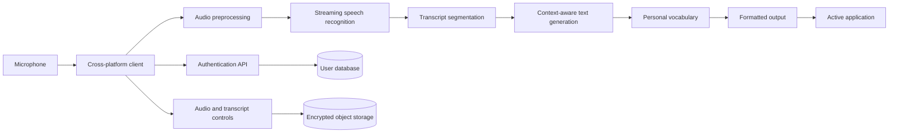

# Design and Implementation of a Cross-Platform AI Voice-Dictation Platform for Context-Aware Text Generation

## Abstract

This paper presents the design of a cross-platform artificial intelligence voice-dictation platform that converts natural speech into polished, context-aware written text. Unlike conventional speech-to-text systems that reproduce spoken language literally, the proposed platform combines automatic speech recognition, language-model-based text refinement, user vocabulary personalization, and application-aware formatting. The system is designed for desktop and mobile environments and can operate inside email clients, messaging applications, document editors, terminals, and other text-entry fields.

The proposed architecture consists of a client application, a streaming audio-processing service, a speech-recognition module, a context-aware language-processing module, a personalization service, and a secure cloud backend. The platform processes spoken input in stages: audio is captured, transmitted, transcribed, cleaned, formatted, and inserted into the user’s active application. Special attention is given to latency, correction handling, multilingual speech, privacy, accessibility, and cross-platform compatibility.

The paper defines an implementation strategy using a desktop client, mobile interfaces, a backend API, a speech-recognition model, a language model, PostgreSQL, object storage, and containerized deployment. It also proposes an evaluation framework based on word error rate, semantic accuracy, formatting quality, latency, correction accuracy, user productivity, and privacy performance. Since the work describes a proposed system rather than a completed commercial product, experimental values are not fabricated; instead, measurable evaluation procedures are provided.

**Keywords:** artificial intelligence, speech recognition, voice dictation, natural language processing, context-aware computing, cross-platform applications, human-computer interaction

## 1. Introduction

Typing is the dominant method for entering text into computers and mobile devices, but it can be slow, physically demanding, and disruptive to the user’s flow of thought. Speech recognition provides a natural alternative, yet conventional dictation systems often reproduce filler words, false starts, repetitions, and uncorrected speech. For example, a user who says, “Send the report Friday—actually, Monday” may receive both dates as raw text instead of the intended final meaning.

Recent AI-based voice tools attempt to solve this problem by combining speech recognition with language-model-based rewriting. These systems do not merely transcribe speech; they attempt to infer what the user intended to write. A useful platform must therefore address several problems simultaneously:

1. Accurate speech recognition in real-world conditions.
2. Removal of filler words and repeated phrases.
3. Detection of spoken corrections.
4. Formatting for different applications.
5. Personalization of names, terminology, and writing style.
6. Low-latency operation.
7. Secure handling of potentially sensitive audio and text.
8. Compatibility with multiple operating systems.

This paper proposes a full-stack architecture for such a platform. The goal is to design a system that allows users to speak naturally while receiving text that is ready to use in the active application.

## 2. Research Objectives

The main objective is to design and implement a cross-platform AI voice-dictation platform capable of producing contextually appropriate text from natural speech.

The specific objectives are to:

- Develop a streaming speech-input pipeline.
- Convert speech into text with low latency.
- Detect filler words, repetitions, and self-corrections.
- Generate polished text while preserving the speaker’s meaning.
- Support different output contexts, including email, chat, documents, and code.
- Personalize recognition using user-specific vocabulary.
- Provide secure account, storage, and privacy controls.
- Evaluate the system using objective and user-centered metrics.

## 3. Related System Concept

Traditional dictation systems generally perform automatic speech recognition and return a literal transcript. This approach is useful when verbatim accuracy is required, but it is less effective for composing messages or documents. Spoken language contains features that are normally removed during writing, including:

- “um” and “uh”
- repeated words
- abandoned sentences
- mid-sentence corrections
- informal grammar
- incomplete thoughts
- spoken punctuation commands

The proposed platform adds a language-processing layer after transcription. This layer transforms a raw transcript into a written representation while attempting to preserve the original intent.

For example:

**Raw speech:**

> “Can you tell the team that the launch is going to slip, not Friday, actually the following Monday, because legal still needs to approve the terms page?”

**Generated text:**

> “Can you let the team know that the launch is slipping to the following Monday? Legal still needs to approve the terms page.”

The system should not rewrite factual content without evidence. Its purpose is to improve clarity and structure, not to invent information.

## 4. Proposed System Architecture

The platform uses a client-server architecture with local and cloud components.



### 4.1 Client application

The client application captures microphone input and manages communication with the backend. It is responsible for:

- Microphone permissions
- Push-to-talk or hands-free recording
- Audio buffering
- Network communication
- Displaying transcription progress
- Inserting text into the active application
- Applying user settings
- Managing offline and connection-error states

A desktop client can be implemented using **Tauri** or **Electron**. A mobile client can use native platform APIs or a cross-platform framework such as React Native. The text-insertion mechanism must use platform-specific accessibility or keyboard APIs because desktop and mobile operating systems expose different input interfaces.

### 4.2 Audio preprocessing

Before transmission, the client can perform basic preprocessing:

- Noise suppression
- Voice activity detection
- Audio normalization
- Silence detection
- Echo reduction
- Audio compression

The audio should be divided into short chunks to support streaming recognition. Let the input audio stream be represented as:

$$
A = \{a_1, a_2, \ldots, a_n\}
$$

where each $a_i$ is a time-ordered audio segment. The client transmits each segment as soon as it becomes available rather than waiting for the entire recording to finish.

### 4.3 Speech-recognition module

The speech-recognition module converts audio into a raw transcript:

$$
T_{\text{raw}} = ASR(A, L, V)
$$

where:

- $A$ is the audio input,
- $L$ is the selected language,
- $V$ is the user vocabulary,
- $T_{\text{raw}}$ is the resulting transcript.

The recognition service should support streaming output so that partial text can be displayed before the speaker finishes. The platform may use a cloud-hosted speech model, a self-hosted model, or an on-device model depending on the required balance between accuracy, cost, latency, and privacy.

### 4.4 Context-aware text generation

The raw transcript is passed to a text-processing module:

$$
T_{\text{final}} = f(T_{\text{raw}}, C, S, V)
$$

where:

- $C$ is application context,
- $S$ is the selected writing style,
- $V$ is the user’s vocabulary and preferences,
- $T_{\text{final}}$ is the polished output.

Possible context values include:

- Email
- Instant message
- Formal document
- Casual note
- Code comment
- Customer-support response
- Academic writing

The processing module should perform the following operations:

1. Remove unnecessary filler words.
2. Resolve repeated words.
3. Interpret spoken corrections.
4. Add punctuation.
5. Divide text into paragraphs.
6. Preserve names, numbers, and technical terms.
7. Apply the user’s selected style.
8. Avoid introducing unsupported facts.

A safety constraint can be expressed as:

$$
\text{Meaning}(T_{\text{final}}) \approx \text{Meaning}(T_{\text{raw}})
$$

The generated text should improve readability while maintaining semantic equivalence.

### 4.5 Personal vocabulary service

Users frequently speak names, acronyms, product names, and technical terms that general speech models may recognize incorrectly. The personalization service stores a vocabulary list:

$$
V = \{(w_i, p_i, c_i)\}_{i=1}^{m}
$$

where:

- $w_i$ is a vocabulary item,
- $p_i$ is its preferred spelling,
- $c_i$ is optional contextual information.

For example:

| Spoken term | Preferred output |
|---|---|
| “Postgres” | PostgreSQL |
| “Open A-I” | OpenAI |
| “Wispr Flow” | Wispr Flow |
| “M-C-P” | MCP |

The service should allow users to add, edit, or delete vocabulary items.

## 5. Full-Stack Implementation

### 5.1 Frontend

The frontend can be implemented using:

- TypeScript
- React
- Tauri for desktop distribution
- React Native or native mobile interfaces
- WebSockets for streaming updates

The main interface should include:

- Recording control
- Language selection
- Writing-style selection
- Live transcript display
- Correction and retry controls
- Vocabulary management
- Privacy settings
- Account and subscription settings

### 5.2 Backend

A backend API can be implemented using FastAPI or Node.js. Its responsibilities include:

- User authentication
- Audio-stream management
- Speech-recognition requests
- Text-generation requests
- Vocabulary synchronization
- Usage tracking
- Billing
- Data-retention controls
- Device synchronization

A possible request flow is:

```text
Client → Authentication API
Client → Audio streaming endpoint
Backend → Speech-recognition service
Backend → Text-generation service
Backend → Client with formatted text
Client → Active text field
```

### 5.3 Database

PostgreSQL can store structured information such as:

- User accounts
- Device registrations
- Language preferences
- writing styles
- Vocabulary entries
- Usage statistics
- Subscription state
- Retention settings

Audio files and large transcripts should be stored separately in encrypted object storage rather than directly in relational database tables.

### 5.4 Authentication and authorization

The system should implement:

- Secure password authentication or OAuth
- Access and refresh tokens
- Device management
- Role-based access control for teams
- Optional SSO/SAML for enterprise users
- Account deletion
- Session revocation

The principle of least privilege should be applied so that each service can access only the data required for its function.

### 5.5 Deployment

The platform can be deployed using Docker containers. A production environment may include:

- API containers
- Speech-processing workers
- Text-processing workers
- PostgreSQL
- Redis
- Encrypted object storage
- Load balancing
- Monitoring and logging
- Automated backups
- Continuous integration and deployment

A queue system can be used for non-real-time tasks such as meeting summarization. Real-time dictation should use a streaming service instead of a long background queue.

## 6. Privacy and Security Design

Voice applications may process highly sensitive information, including private conversations, medical information, financial data, passwords, and confidential business content. Privacy must therefore be treated as a core architectural requirement.

The proposed system should include:

- Encryption in transit using TLS
- Encryption at rest
- Configurable transcript retention
- Optional audio deletion after processing
- User-controlled model-training consent
- Audit logs for enterprise accounts
- Data export and deletion
- Clear recording indicators
- Protection against unauthorized microphone access
- Separation of user data between accounts

A privacy-preserving configuration may use the following policy:

$$
D_{\text{stored}} = \varnothing
$$

when the user chooses not to store audio or transcripts. In this configuration, audio is processed temporarily and deleted after the output is delivered.

The system should also clearly distinguish between:

- Data required to provide the service
- Data stored for synchronization
- Data used for personalization
- Data optionally used to improve models

## 7. Evaluation Methodology

The platform should be evaluated using both technical and user-centered metrics.

### 7.1 Speech-recognition accuracy

The primary metric is word error rate:

$$
WER = \frac{S + D + I}{N}
$$

where:

- $S$ is the number of substitutions,
- $D$ is the number of deletions,
- $I$ is the number of insertions,
- $N$ is the number of words in the reference transcript.

Testing should include:

- Quiet rooms
- Open offices
- Outdoor environments
- Background music
- Accented speech
- Fast speech
- Low-volume speech
- Multiple languages
- Code and technical vocabulary

### 7.2 Semantic preservation

Because the platform intentionally edits spoken language, word-level accuracy alone is insufficient. Human evaluators should rate whether the final text preserves the intended meaning.

A semantic-preservation score can be calculated as:

$$
S_{\text{semantic}} =
\frac{\text{outputs judged meaning-preserving}}
{\text{total evaluated outputs}}
$$

### 7.3 Formatting quality

Formatting should be assessed using criteria such as:

- Correct punctuation
- Appropriate paragraph breaks
- Correct lists
- Correct capitalization
- Suitable tone
- Proper handling of dates and numbers
- Appropriate formatting for the active application

### 7.4 Latency

End-to-end latency is the time between the user finishing a phrase and the final text appearing in the target application:

$$
L_{\text{total}} =
L_{\text{capture}} +
L_{\text{network}} +
L_{\text{ASR}} +
L_{\text{generation}} +
L_{\text{insertion}}
$$

A practical system should minimize each component, especially network, speech-recognition, and text-generation latency.

### 7.5 Productivity evaluation

A controlled user study can compare the proposed system with keyboard typing and conventional dictation. Measurements may include:

- Words produced per minute
- Number of corrections
- Task completion time
- Number of application switches
- User fatigue
- Perceived accuracy
- User trust
- Willingness to continue using the system

### 7.6 Suggested experimental groups

The evaluation could include:

- Group A: keyboard typing
- Group B: operating-system dictation
- Group C: proposed AI voice-dictation platform

Each participant could complete email, messaging, note-taking, and technical-writing tasks under the same environmental conditions.

## 8. Expected Results

The proposed platform is expected to improve the usability of voice input in three ways.

First, context-aware text generation should reduce the amount of manual cleanup required after dictation. Second, personalization should improve the recognition of names, acronyms, and domain-specific vocabulary. Third, system-wide text insertion should reduce the need to switch between a dictation tool and the application where the text is needed.

However, the system may perform less reliably when:

- Multiple people speak simultaneously.
- The user changes topics rapidly.
- Speech contains ambiguous names or numbers.
- The microphone is distant or heavily compressed.
- The language model over-edits informal or specialized language.
- The network connection is unstable.

These cases should be included in testing rather than excluded from the evaluation.

## 9. Limitations

The proposed design has several limitations.

1. Cloud processing can introduce privacy risks and network dependency.
2. Large language models may incorrectly alter dates, names, or technical facts.
3. Cross-platform text insertion requires different implementations for each operating system.
4. Speech quality can vary significantly between microphones and environments.
5. Supporting many languages requires language-specific testing and personalization.
6. Cloud inference can create substantial operating costs at scale.
7. Objective speech-recognition accuracy does not fully measure writing quality or user satisfaction.

The system should therefore provide a way to view, undo, or restore generated text before it replaces important content.

## 10. Conclusion

This paper presented a full-stack design for a cross-platform AI voice-dictation platform that transforms natural speech into polished, context-aware text. The proposed system combines microphone capture, streaming speech recognition, language-model-based rewriting, personalization, secure cloud services, and application-level text insertion.

The central contribution is the integration of speech recognition with context-aware text generation. Conventional dictation attempts to reproduce what a speaker says, while the proposed platform attempts to produce what the speaker intended to write. This requires careful handling of corrections, filler words, formatting, terminology, latency, and privacy.

Future work should investigate on-device speech processing, improved multilingual and code-switching support, adaptive user profiles, real-time semantic confidence scores, and direct voice-controlled actions such as creating documents, updating project systems, or drafting responses. The proposed architecture provides a foundation for these capabilities while maintaining a measurable and testable full-stack implementation.

## Proposed Technology Stack

| Component | Suggested technology |
|---|---|
| Desktop client | Tauri and Rust |
| Frontend | React and TypeScript |
| Mobile client | React Native or native Swift/Kotlin |
| Backend API | Python FastAPI |
| Real-time transport | WebSockets |
| Speech recognition | Streaming ASR model |
| Text refinement | Large language model |
| Database | PostgreSQL |
| Cache and queues | Redis |
| File storage | S3-compatible encrypted storage |
| Authentication | OAuth 2.0 and JWT |
| Payments | Stripe |
| Deployment | Docker and Kubernetes |
| Monitoring | OpenTelemetry and Grafana |

**Important research distinction:** this is a proposed academic design for a Wispr Flow–style application, not a claim about Wispr Flow’s private internal implementation. Wispr publicly describes Flow as a cross-platform voice-to-text product and lists its public features, but it does not disclose its complete production source code or internal technology stack. [Wispr Flow](https://wisprflow.ai/) [Official pricing and features](https://wisprflow.ai/pricing) [Privacy and security](https://wisprflow.ai/privacy)
