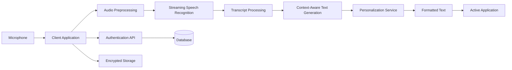

# Design and Implementation of a Cross-Platform AI Voice-Dictation Platform for Context-Aware Text Generation

## Abstract

Voice-based human–computer interaction has become an important alternative to conventional keyboard input. Traditional speech-to-text systems generally produce literal transcripts and often preserve filler words, repetitions, incomplete phrases, and spoken corrections. This paper proposes the design and implementation of a cross-platform artificial intelligence voice-dictation platform that converts natural speech into clear, formatted, and contextually appropriate text. The proposed system combines streaming automatic speech recognition, natural-language processing, user-specific vocabulary, context detection, and secure cloud services.

The platform is designed for desktop and mobile operating systems and can insert generated text into email clients, messaging applications, document editors, code editors, and other text-entry fields. The architecture contains a client application, audio-processing module, speech-recognition service, context-aware language-processing module, personalization service, database, and secure storage layer. The system is evaluated using word error rate, semantic-preservation accuracy, formatting quality, response latency, correction accuracy, and user productivity. The proposed design provides a foundation for faster and more natural written communication while addressing challenges related to privacy, latency, multilingual speech, and cross-platform compatibility.

**Keywords:** artificial intelligence, speech recognition, voice dictation, natural-language processing, context-aware computing, cross-platform software, human–computer interaction

## 1. Introduction

Keyboard-based text entry remains the primary method of communication on computers and mobile devices. Although keyboards provide accurate input, typing can be slow, physically demanding, and disruptive to a user's thought process. Voice dictation provides a natural alternative by allowing users to speak instead of type. However, conventional dictation systems frequently produce literal transcripts that contain filler words, grammatical errors, repetitions, and unfinished sentences.

For example, a user may say:

> "Please send the report on Friday—actually, Monday—because the client has not approved the final version."

A literal transcription may preserve both dates, while an intelligent system should identify the correction and produce:

> "Please send the report on Monday because the client has not approved the final version."

Artificial intelligence can improve dictation by combining automatic speech recognition with language-model-based text refinement. Such a system must recognize not only what the user said, but also what the user intended to write. It must preserve meaning, identify context, format the output appropriately, and support different devices and applications.

This paper proposes a full-stack architecture for a cross-platform AI voice-dictation platform. The design focuses on real-time speech processing, context-aware text generation, personalization, privacy, and measurable system performance.

## 2. Problem Statement

Existing speech-to-text systems have several limitations:

1. They often transcribe filler words and repetitions.
2. They may fail to interpret mid-sentence corrections.
3. They provide limited formatting and punctuation.
4. They do not always understand application context.
5. They may perform poorly with names, acronyms, and technical vocabulary.
6. They may not provide consistent functionality across operating systems.
7. Cloud-based processing can create privacy and security concerns.
8. Long processing times can interrupt a user's workflow.

The problem addressed in this research is the design of a system that transforms natural speech into accurate, readable, and contextually appropriate text with low latency across multiple platforms.

## 3. Research Objectives

The main objective is to design and implement a cross-platform AI voice-dictation platform for context-aware text generation.

The specific objectives are:

- To capture and process speech in real time.
- To convert speech into text using automatic speech recognition.
- To remove unnecessary filler words and repetitions.
- To identify spoken corrections and preserve the final intended meaning.
- To format output according to application context.
- To support user-specific vocabulary and terminology.
- To provide secure storage and privacy controls.
- To evaluate accuracy, latency, usability, and productivity.

## 4. Proposed System

The proposed system consists of six main layers:

1. Client application
2. Audio-processing layer
3. Speech-recognition layer
4. Context-aware language-processing layer
5. Personalization and data layer
6. Application-integration layer



### 4.1 Client Application

The client application captures audio from the microphone and provides the user interface. It is responsible for:

- Requesting microphone permission
- Starting and stopping dictation
- Streaming audio data
- Displaying partial transcripts
- Showing processing status
- Inserting final text into the active application
- Managing user settings
- Synchronizing preferences across devices

The desktop version may be implemented using Tauri or Electron. Mobile versions may use React Native or native development frameworks such as Swift for iOS and Kotlin for Android.

### 4.2 Audio Preprocessing

The audio-processing layer improves the quality of input before speech recognition. It may include:

- Noise reduction
- Voice activity detection
- Echo cancellation
- Audio normalization
- Silence detection
- Audio compression

The audio stream is divided into sequential segments:

$$
A = \{a_1, a_2, a_3, \ldots, a_n\}
$$

where each $a_i$ represents a short audio segment. Streaming segments reduces the time required before transcription begins.

### 4.3 Automatic Speech Recognition

The automatic speech-recognition module converts audio into a raw transcript:

$$
T_{\text{raw}} = ASR(A, L, V)
$$

where:

- $A$ is the audio stream,
- $L$ is the selected language,
- $V$ is the user vocabulary,
- $T_{\text{raw}}$ is the raw transcript.

The system should support both partial and final transcription. Partial transcription allows users to see words while they are speaking, whereas final transcription is generated after sufficient context is available.

### 4.4 Context-Aware Text Generation

The context-aware processing module converts the raw transcript into polished text:

$$
T_{\text{final}} = F(T_{\text{raw}}, C, S, V)
$$

where:

- $T_{\text{raw}}$ is the speech-recognition output,
- $C$ is the application context,
- $S$ is the selected writing style,
- $V$ is the user vocabulary,
- $T_{\text{final}}$ is the final generated text.

Possible contexts include:

- Formal email
- Casual message
- Academic document
- Meeting note
- Customer-support response
- Code comment
- Social-media post

The text-generation module performs the following operations:

1. Removes filler words.
2. Removes accidental repetitions.
3. Resolves spoken corrections.
4. Adds punctuation.
5. Creates paragraphs and lists.
6. Corrects grammar.
7. Preserves names and technical terms.
8. Applies the user's preferred tone.
9. Avoids adding unsupported information.

The system must maintain semantic equivalence:

$$
\text{Meaning}(T_{\text{final}}) \approx \text{Meaning}(T_{\text{raw}})
$$

The goal is not to rewrite the user's message unnecessarily, but to convert speech into usable written language.

### 4.5 Personalization

The personalization module improves recognition of user-specific language. It stores terms such as:

- Names
- Product names
- Acronyms
- Technical terms
- Company terminology
- Frequently used phrases

A personalized vocabulary can be represented as:

$$
V = \{(w_i, p_i, c_i)\}_{i=1}^{m}
$$

where $w_i$ is the spoken term, $p_i$ is its preferred written form, and $c_i$ is optional contextual information.

For example:

| Spoken expression | Preferred output |
|---|---|
| Postgres | PostgreSQL |
| Open A I | OpenAI |
| M C P | MCP |
| Wispr Flow | Wispr Flow |

Users should be able to add, modify, and delete vocabulary items.

## 5. System Architecture

### 5.1 Frontend Layer

The frontend provides the user interface and controls. A possible implementation uses:

- React
- TypeScript
- Tauri for desktop packaging
- React Native for mobile applications
- WebSockets for real-time communication

The interface should include:

- Dictation button
- Push-to-talk control
- Language selector
- Writing-style selector
- Live transcript display
- Vocabulary editor
- Privacy settings
- Account management
- Error and connection notifications

### 5.2 Backend Layer

The backend manages authentication, audio processing, text generation, synchronization, and user data. It may be implemented using FastAPI, Node.js, or another scalable web framework.

The backend performs the following operations:

- Authenticates users
- Receives audio streams
- Sends audio to the speech-recognition service
- Processes transcripts
- Applies user vocabulary
- Generates formatted text
- Tracks usage
- Synchronizes devices
- Manages subscriptions
- Enforces data-retention policies

### 5.3 Database Layer

PostgreSQL can store structured application data, including:

- User accounts
- Device information
- Language preferences
- Writing styles
- Vocabulary entries
- Usage records
- Subscription information
- Data-retention preferences

Large audio files and transcripts should be stored separately in encrypted object storage when the user enables storage.

### 5.4 Communication Layer

WebSockets are suitable for real-time audio and transcript updates. The communication process is:

```text
Client → Authentication service
Client → Audio-streaming endpoint
Backend → Speech-recognition service
Backend → Context-processing service
Backend → Client with formatted text
Client → Active application
```

For long-running jobs such as meeting summarization, Redis and a background task queue may be used.

### 5.5 Application Integration

The platform must insert text into the application currently being used. On desktop systems, this may involve:

- Clipboard operations
- Keyboard simulation
- Accessibility APIs
- Operating-system input APIs

On mobile platforms, integration may use:

- Custom keyboard extensions
- Accessibility services
- Share-sheet actions
- Application programming interfaces provided by the operating system

Because every operating system has different security restrictions, platform-specific integration is required.

## 6. Privacy and Security

Voice applications may process sensitive information, including medical details, financial data, passwords, private conversations, and confidential business content. Security must therefore be included in the architecture from the beginning.

The proposed system should provide:

- TLS encryption during transmission
- Encryption at rest
- Secure authentication
- Role-based authorization
- Configurable data retention
- Audio deletion after processing
- Transcript deletion
- User-controlled model-training consent
- Data export
- Account deletion
- Device and session management
- Enterprise audit logs

A privacy-preserving configuration may delete all temporary data after processing:

$$
D_{\text{stored}} = \varnothing
$$

where $D_{\text{stored}}$ represents stored audio and transcript data.

The platform should clearly distinguish between data required to provide dictation, data stored for synchronization, data used for personalization, and data optionally used to improve artificial-intelligence models.

## 7. Proposed Technology Stack

| System component | Proposed technology |
|---|---|
| Desktop application | Tauri and Rust |
| Frontend | React and TypeScript |
| Mobile application | React Native or native Swift/Kotlin |
| Backend API | Python FastAPI |
| Real-time communication | WebSockets |
| Speech recognition | Streaming automatic speech-recognition model |
| Text processing | Large language model |
| Database | PostgreSQL |
| Cache and queues | Redis |
| File storage | Encrypted object storage |
| Authentication | OAuth 2.0 and JSON Web Tokens |
| Payments | Stripe |
| Deployment | Docker and Kubernetes |
| Monitoring | OpenTelemetry and Grafana |

## 8. Algorithm

### Algorithm 1: Context-Aware Voice Dictation

```text
Input: Audio stream A, language L, context C, style S
Output: Formatted text T_final

1. Capture audio from the microphone.
2. Divide audio into short segments.
3. Apply noise reduction and voice activity detection.
4. Send audio segments to the speech-recognition service.
5. Generate the raw transcript T_raw.
6. Detect filler words, repetitions, and spoken corrections.
7. Load the user's vocabulary V.
8. Identify the active application and context C.
9. Apply grammar correction and punctuation.
10. Generate context-aware text using T_raw, C, S, and V.
11. Validate semantic similarity between raw and final text.
12. Display the final text to the user.
13. Insert the text into the active application.
14. Store or delete data according to user privacy settings.
```

## 9. Evaluation Methodology

The proposed system should be evaluated using technical benchmarks and user studies.

### 9.1 Word Error Rate

Word error rate measures the difference between the reference transcript and the system transcript:

$$
WER = \frac{S + D + I}{N}
$$

where:

- $S$ is the number of substitutions,
- $D$ is the number of deletions,
- $I$ is the number of insertions,
- $N$ is the number of words in the reference transcript.

Testing should include quiet rooms, noisy offices, outdoor locations, accented speech, fast speech, quiet speech, technical vocabulary, and multilingual speech.

### 9.2 Semantic Preservation

Since the system intentionally edits speech, word error rate alone is insufficient. Human evaluators should determine whether the final output preserves the speaker's intended meaning.

The semantic-preservation score is:

$$
S_{\text{semantic}} =
\frac{\text{meaning-preserving outputs}}
{\text{total evaluated outputs}}
$$

### 9.3 Formatting Quality

Formatting quality can be assessed using:

- Punctuation accuracy
- Paragraph structure
- List formatting
- Capitalization
- Tone appropriateness
- Date and number accuracy
- Application-specific formatting

### 9.4 Latency

End-to-end latency is defined as:

$$
L_{\text{total}} =
L_{\text{capture}} +
L_{\text{network}} +
L_{\text{ASR}} +
L_{\text{generation}} +
L_{\text{insertion}}
$$

where each component represents the time spent in one stage of the processing pipeline.

Lower latency improves the user experience and reduces disruption during composition.

### 9.5 Correction Accuracy

Correction accuracy measures the system's ability to interpret spoken revisions. It can be calculated as:

$$
CA =
\frac{\text{correctly resolved corrections}}
{\text{total spoken corrections}}
$$

Test cases should include corrections involving:

- Names
- Dates
- Times
- Numbers
- Locations
- Technical terms
- Sentence structure

### 9.6 Productivity Evaluation

A user study can compare three conditions:

- Keyboard typing
- Conventional operating-system dictation
- Proposed AI voice dictation

Participants can complete email-writing, messaging, note-taking, and technical-writing tasks. The evaluation can measure words per minute, task completion time, number of manual corrections, number of application switches, user fatigue, perceived accuracy, user satisfaction, and willingness to continue using the system.

## 10. Expected Results

The proposed system is expected to reduce the amount of manual editing required after dictation. Context-aware processing should produce more readable text than literal transcription, while personalization should improve recognition of names, acronyms, and specialized vocabulary.

The system is also expected to increase written productivity by allowing users to compose text at speaking speed. Cross-platform integration should reduce the need to switch between a dictation application and the application where the text is required.

Performance may decrease in the presence of:

- Multiple simultaneous speakers
- Severe background noise
- Unusual accents
- Ambiguous names
- Rapid topic changes
- Unstable internet connections
- Highly specialized vocabulary

These conditions should be included in the evaluation to ensure that results represent real-world use.

## 11. Limitations

The proposed system has several limitations.

First, cloud-based speech recognition may require a stable internet connection and may introduce privacy concerns. Second, language models may incorrectly modify names, dates, numbers, or technical statements. Third, supporting multiple operating systems requires separate integration strategies. Fourth, multilingual and code-switching speech may require additional model training. Fifth, continuous audio processing can create significant computational and financial costs.

The system should therefore provide an undo function, confidence indicators, transcript review, and user-controlled storage settings.

## 12. Future Work

Future research may focus on:

- On-device speech recognition
- Offline operation
- Multilingual code-switching
- Improved recognition of technical vocabulary
- Personalized language models
- Voice-controlled application actions
- Automatic document and email creation
- Speaker identification
- Privacy-preserving federated learning
- Adaptive context detection
- Real-time confidence estimation
- Direct integration with productivity platforms

A future version could move beyond text generation and perform actions such as creating calendar events, updating project-management systems, drafting emails, or generating code from spoken instructions.

## 13. Conclusion

This paper proposed the design and implementation of a cross-platform AI voice-dictation platform for context-aware text generation. The system combines audio capture, streaming speech recognition, language-model-based text refinement, user-specific vocabulary, application context, secure storage, and cross-platform text insertion.

Unlike conventional dictation systems that reproduce speech literally, the proposed platform aims to generate text that reflects the user's intended written communication. The architecture addresses important requirements including low latency, semantic preservation, formatting, personalization, privacy, and usability.

The proposed system provides a practical foundation for voice-first human–computer interaction. Its success should be measured not only by transcription accuracy, but also by semantic correctness, formatting quality, user productivity, latency, and trust. With continued improvements in speech recognition and natural-language processing, AI voice dictation can become a reliable interface for writing, communication, programming, and everyday computer interaction.
